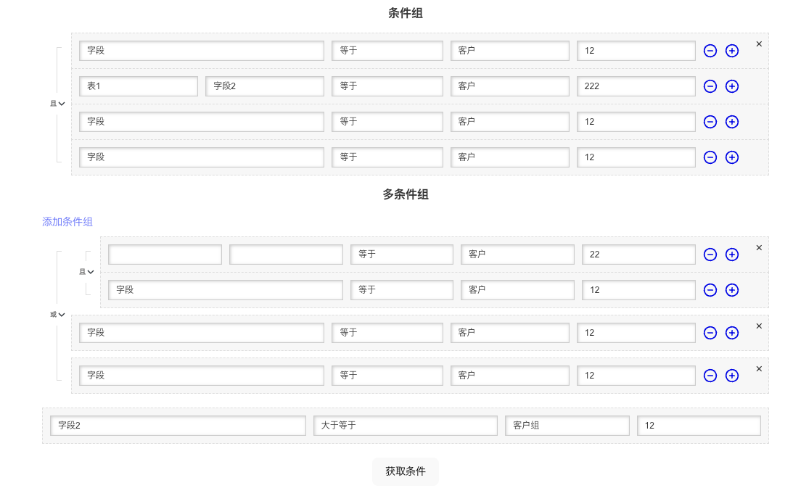

# uni-conditions

## 介绍

条件组组件对于一个权限系统或者角色系统，可以很方便的实现权限控制。在后台业务场景中使用较多，目前公司内部条件组组件存在多套且条件组结构不同，所以需要一个组件统一处理。因此，开发了此组件。统一处理条件组组件，可以减少开发工作量，提高开发效率。

## 功能点

* [] 支持多种条件数据格式，如条件显示维度。
* [] 支持自定义条件类型（等于、不等于、大于、小于等）
* [] 支持嵌套条件组（AND, OR 操作）。
* [] 动态添加、删除条件或条件组。
* [] 可配置的操作符和字段类型。
* [] 可自定义数据转换函数，处理选择后的数据转换。

## 预览



## 安装

说明如何安装组件：

```sh
npm install uni-conditions --save
```

或者

```sh
yarn add uni-conditions
```

## 使用方法

`uni-conditions` 提供了两个组件 `Condition` 和 'UniCondition'

```vue
<script setup>
import { ref } from 'vue';
import { UniCondition, Condition } from './components/conditions';
import { Condition } from './components/conditions';
import { single, singleConditions, multipleCondition } from './components/conditions/src/mock';

const condObj = ref(single);
const condObj2 = ref(singleConditions);
const condObj3 = ref(multipleCondition);

const getConditionOptions = (curCond, property) => {
    switch (property) {
        case 'factor':
        case 'fieldId':
            return [
                {
                    label: '字段',
                    value: 'field',
                },
                {
                    label: '字段2',
                    value: 'field2',
                },
                {
                    label: '字段3',
                    value: 'field3',
                },
                {
                    label: '字段4',
                    value: 'field4',
                },
            ];
        case 'tableId':
            return [
                {
                    label: '表1',
                    value: 'table1',
                },
                {
                    label: '表2',
                    value: 'table2',
                },
                {
                    label: '表3',
                    value: 'table3',
                },
                {
                    label: '表4',
                    value: 'table4',
                },
            ];
        case 'operator':
            if (curCond.operand.factor === 'field' || curCond.operand.fieldId === 'field') {
                return [
                    { label: '等于', value: 'equal' },
                    { label: '不等于', value: 'notEqual' },
                    { label: '大于', value: 'greaterThan' },
                    { label: '小于', value: 'lessThan' },
                    { label: '大于等于', value: 'greaterThanOrEqual' },
                    { label: '小于等于', value: 'lessThanOrEqual' },
                ];
            }
            return [
                { label: '等于', value: 'equal' },
                { label: '不等于', value: 'notEqual' },
                { label: '大于', value: 'greaterThan' },
                { label: '小于', value: 'lessThan' },
                { label: '大于等于', value: 'greaterThanOrEqual' },
                { label: '小于等于', value: 'lessThanOrEqual' },
                { label: '包含', value: 'contains' },
                { label: '不包含', value: 'notContains' },
                { label: '以...开始', value: 'startsWith' },
            ];
        case 'valueType':
            return [
                { label: '字符串', value: 'string' },
                { label: '数字', value: 'number' },
                { label: '日期', value: 'date' },
                { label: '客户', value: 'customer' },
                { label: '客户组', value: 'customerGroup' },
                { label: '订单', value: 'order' },
                { label: '订单项', value: 'orderItem' },
                { label: '自定义', value: 'customer' },
            ];
    }
};

/**
 * 选择表确认字段 -> 字段 -> 通过字段类型确认 -> 判断符 -> 字段类型 -> 值类型 -> 值
 */
</script>

<template>
    <uni-condition
        title="条件组"
        :conditions="condObj2"
        @update:conditions="(value) => (condObj2 = value)"
        :add="
            () => ({
                operand: {
                    factor: 'field',
                },
                operator: 'equal',
                value: [
                    {
                        valueType: 'customer',
                        value: '12',
                    },
                ],
            })
        "
        :getOptions="getConditionOptions"
    />

    <uni-condition
        title="多条件组"
        type="MULTIPLE"
        :conditions="condObj3"
        @update:conditions="(value) => (condObj3 = value)"
        :add="
            () => ({
                operand: {
                    factor: 'field',
                },
                operator: 'equal',
                value: [
                    {
                        valueType: 'customer',
                        value: '12',
                    },
                ],
            })
        "
        :getOptions="getConditionOptions"
    />

    <Condition
        :condition="condObj"
        @update:condition="(value) => condObj = value"
        :getOptions="getConditionOptions"
    />

    <button style="margin: 20px 0 0;" @click="() => console.log(condObj2)">获取条件</button>
</template>
```

### uni-condition

### 属性（Props）

列出组件接受的所有props，并为每个prop提供类型、默认值和描述：
| Prop | 类型 | 默认值 | 描述 |
| ---- | ---- | ------- | ---- |
| option | string | - | 组件的配置选项。 |

### 事件（Events）

列出组件触发的所有事件，包括事件的名称、参数和描述：

* `event-name`
  * 参数：`event.detail`
  * 描述：当...时触发此事件。

### 插槽（Slots）

如果有的话，描述组件提供的插槽及其用途：

* `default`：默认插槽，用于...

### 计算属性（Computed）

如果有的话，列出组件的计算属性和它们的描述。

### 方法（Methods）

如果有的话，列出组件的方法及其描述。

### 深入指南

提供更深入的使用示例或高级配置选项。

### 变更日志（Changelog）

记录组件的主要变更和版本历史。

### 贡献

说明如何为组件贡献代码或报告问题。

### 许可

[MIT](LICENSE) © 2024-present, victor-won

### 作者

提供组件作者的信息，包括联系信息或社交媒体链接。
